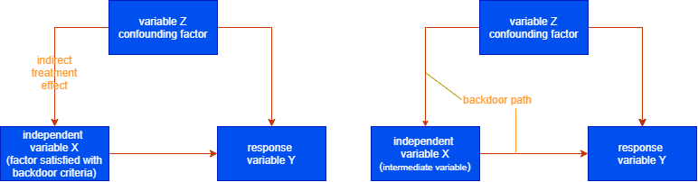

# Causual Inference

## 1 What is Causal relationship?

We often compare two groups to find a difference between them. For instance, We want to measure the influence of TV. A group often watches TV whereas, B group doesn't. We want to know which group is more interested in buying a product.
It is not always right when you compare two groups. You rather need to compare a group watches TV and a imaginary group which what if those people watches TV would not do that. The second group is not real so we cannot directly measure the impact of them on buying the product. However, using Causal relationship technique enables you to estimate the impact. 
In summary, correlation is a just relationship denoted with a "line" connecting two variables. On the other hand, causual relation is a relationship denoted with an "arrow" that A directly connects to B. A directs to B.

## 2 What is difference between correlation and causal relationship?

- Correlation means something related to each other

- Causal relationsihp means A affects on B. 

## 3 What is spurious correlation?

- relationship between two variables seem causual but actually it is not. A third factor exsits and it makes them directly apparently connected to one another.

-  case 1: 
  when you think x effects on y but truth is y has impact on x. This case is one of spurious correlation types.
- case 2:
  When you think x eefects on y but truth is there is z in between x and y. Z effects on y as well as x. This case is also spurious correlation. z is called confounding factor and this relationship is confounding.
- case 3:
  You look at two independent variables which are not correlated to one another. When you show scappter plot and describe a line separete into two parts according to a dependent variables which is binomial. Checking a group, you would see a correlation between the two independent variables even though they are independent. This case is also spurious correlation.

## 4 Counterfactual theory
- As I already mentioned, causal relationship is to compare y and $y_1$ and $y_0$. $y_1$ is actual observation, that is a dependent variables. On the other hand, $y_0$ is imaginary dependent variables. In other wards, it did not happen. It is something like an event observed in a paralell world. To compare these two ys, we can understand influence on y by something as independent variables.
This imaginary fact is called being counterfactual. 

## 5 Framework of potential outcomes
  In Rubin causal model, the dependent variable has two potential outcomes. One is case where it happens, another is case where it does not happen. One is real and observed. This is denoted as $y_1$ ,whereas, the other is not real and observed, which is denoted as $y_0$.

## 6 Treatment Effect
  Treatment Effect is the influence of independent variables on y. This can be computed as $y_1 - y_0$. 

### 6-1 Individual Treatment Effect(ITE)
  Individual Treatment Effect is Treatment Effect of each individual obsevation.Therefore, it is denoted as $y_1^i - y_0^i$.

### 6-2 Average Treatment Effect(ATE)
  Average Treatment Effect is Treatment Effect of all observations. Therefore, it is denoted as $E(Y_1 - Y_0) = \frac{1}{N}\sum_{i = 1}^N(y_1^i - y_0^i) = \frac{1}{N}\sum_{i = 1}^N(y_1^i) - \frac{1}{N}\sum_{i = 1}^N(y_0^i)$ 

### 6-3 Average Treatment Effect on the Treated(ATT)
  One of ATE. ATT is only the difference between $y_1$ and $y_0$ when an independent variable's level is 1. It is denoted as   $\frac{1}{N}\sum_{n = 1}^N(y_1^i - y_0^i| z = 1)$
  Let's say you want to measure the effect of training on running time, so some of observations trained but the others did not.ATT is about only those who has trained. The counterfactual is the case what if they had not trained. 

### 6-4 Average Treatment Effect on the Untreated(ATU)
  The opposite case of ATT.
  $\frac{1}{N}\sum_{n = 1}^N(y_1^i - y_0^i| z = 0)$

### 6-5 Conditional Average Treatment Effect(CATE)
 Treatment Effect of an independent variable is condition such as the one of level A. 
  $\frac{1}{N}\sum_{n = 1}^N(y_1^i - y_0^i| x = 0)$

## 7 intervation
Intervation is a techunique to remove a variable which indirectly connected to the dependent variables. There are two approaches introduced in this section.

### do operator
  The action to force to change levels. For instance, when someone doesn't train, you will change the variable to train. This operation is called Do Operation.

$do(z = 1)$

This operation can be used to resolve a spurious correlation. Let's say, there is a correlation between the number of broccolies and the fat rate. These variables has a positive correlation, that something weird because I assume that eating broccolies would help you to lose fat rather than gain fat. This is because we often eat them with mayonnaise, that is there is confounding factor. It has two levels: with mayonnaise or without. Let's carry out do operator. Do operator forces to change a level to the other, like everyone eat broccolies with mayonnaise. Then, the relationship changed to solve the confounding factor. In other ward, the relationship between mayonnaise and broccoli will never be because everyone has mayonnaise when they eat broccolies. 
In a nutshell, we want to know the treatment effect of counterfactual response variable. When there is a spurious correlation, we cannot estimate it propery because there should be indirect treatment effect. To solve the indirect treatmetn effect, do operator is useful because it helps to lose a confounding factor. 

### Randomized Controlled Trials
Let's say you want to measure a treatment effect of training program on subordiates' satisfaction. This training program is for bosses. The independent variable is a binary variable if a boss takes the program or not. The dependent variable is subordinates' satisfaction. You may notice whether or a boss takes the training program really depends on the boss's passion. Besides, if a boss is passionated to educate their subordiates,they may be more satisfied with thier work. Thus, the passion is confounding factor.

## 8 Modification
Do operatior can be useful to solve spurious correlation. However, it can be denoted with a mathmatics. To express the operation, modification is required.

When you look at the do operator, we confirmed the folowwing two relationships has same result.

That can be denoted as follows:

$P(Y = y| do(Z = z)) = P_m(Y = y| Z= z)$

We want to transforma this formula into something can be computed because we cannot calculate the $P_m$ which is the probability after conducting do operator. Let's say you force z to equal to one. This is counterfactual so it is not real. That is reason why you cannot compute this formula directly. Then, the purpose to transform this formula is to enable to be calculated without $P_m$. You can transform it using conditional probability thorem and here is the result.

$P(Y = y| do(Z = z)) = \sum_xP(Y = y | Z = z, X = x)P(X = x)$

This property enables you to compute the $y_0$. For example, you may remember ATE is $\frac{1}{N}\sum_{n = 1}^N(Y_1^i) - \frac{1}{N}\sum_{n = 1}^N(Y_0^i)$

This can be transformated as follows:

$E(Y_1) - E(Y_0) = E(Y_1|do(z = 1)) - E(Y_0|do(Z = 0))$

$= E(Y = Y_1| Z = 1, X = x)P(X = x) - E(Y = y_0| Z = 0, X = x)P(X =x)$

Thus, now you can compute a response variable which is not real and you cannot directly observe by using the modification propety.

However, how do you identify the variable Z? Remeber Z is a confounding factor and generate a indirect treatment effect. The example above shows there are only three variables. In the real business, there a hundred or thorsand of variables and often a confounding variable is related to more than two variables. 

To clearify this problem, we need to learn DAG and SEM. Using these techuniques enables you to decide which variables should apply modification.

## 9  covariate

When Z effect on X and Y and Z is variable that should be considered as modification, Z is called covariate.

## 10 DAG

When you clearfy the relationship among variables, causal graph is useful to express it. Causal graph describes relationship with nodes and lines. Nodes are denoted as square shape to express variables, whreas linse are denoted as arrows to express relationships. Lines are sometimes not arrows but just lines when you are not sure the causality. 
Usually the object in Causal graph is Directed Acyclic Graph(DAG). Being dicrected means you know the causality among variables(only arrows). Acyclic means you are not allowed to describe arrows which from and to a variables itself. For instance, variable A effects on A itself or variable A effects on B and B effects on A. These cases are not Acylic. 

DAG treats only covariates. In other words, if a variable is not covariate, you should not describe it in the DAG.

Basically, if you can describe DAG, you can compute treatment effect. Therefore, it is vital to know how to build a DAG.

DAG consists of nodes and arrows. Again, DAG treats as only dicreted acylic graph, which means, you have to identify relations and directions. 

Relation means if two variables are independent or dependent. That can be tested with Chi-squared test

Direction is which variable(node) is cause and which variable is result. That can be identified with Oriantation rules.

## 11 backdoor path

When there is an indirect treatment effect, the path is called backdoor path.
Backdoor is alway needed to close since it causes to spurious correlation.

An intermediate variable and factor satisfied with backdoor criteria should be closed. Forthermore, the variables connected FROM a dependent variable also should be closed. 

## 12 d-separation
How to decide factors needed to consider for modification? The one of ways is d-separation. It is a tool to close pathes that indirectly effects on the dependent variable. There are some approaches to solve backdoor path in d-separation.

- close a path having an intermediate variable
- close a path having spurious correlation
- close a path having selection of interaction.
- close a path directly connected to the dependent variable.

## 13 casual inference
Causal inference aims to estimate pure impact of a dependent variable. In other word, we want to estimate y but this y is just only amount of direct impact of a specific independent variable.

### Linear and no mutual impact
If the relationship between two independent variables are linear, and they are not influential to one another, the following methods are useful to estimate betas.

- Linear regression(regression adjustment)
- Inverse Probability of Treatment weighting(IPTW)
- Douby Robust(DR method) 

### Not linear and mutual impact
If the relationship between two independent variables are not linear, and they mutually impact on each other, the following methods are useful to estimate betas.
- Meta Learners(T-Leaner, S-Learner, X-Learner) 
- Durby Robust Learning

## 14 Causal Discovery
Causal Inference is a tool to estimate amount of direct impact of independent variables, whereas Causal Discovery is to find a relationship among variables.

When you want to implement Causal Inference, you have to know clear relationship among variables such as which variable is connected to another or which variable a causal factor and another is response.

In other word, if you have no idea about how variables are connected to each other, first you shoud do is Causal Discovery before Causal Inference to estimate betas and directions.

There are some ways to implement Causal Discovery as follows.

### tools to estimate betas, and dependence or independence of independent variables
- Linear Non Gaussian Ayclic Model(LiNGAM)
- Bayesian Network model
- SAM
- G-square test(depenence)

### Bayesian Network Model
- Score-based Structure Leaning(AIC,BIC,MDL,BDe,Bdeu,K2)
- Constraint-based Structure Learning(G-square, oriantation rules,PC algorithm)
- Hybrid Structure Leaning(MMHC algorithm)

